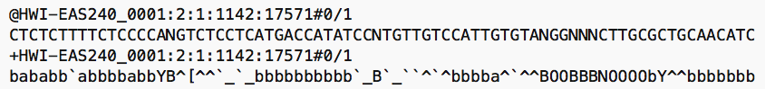
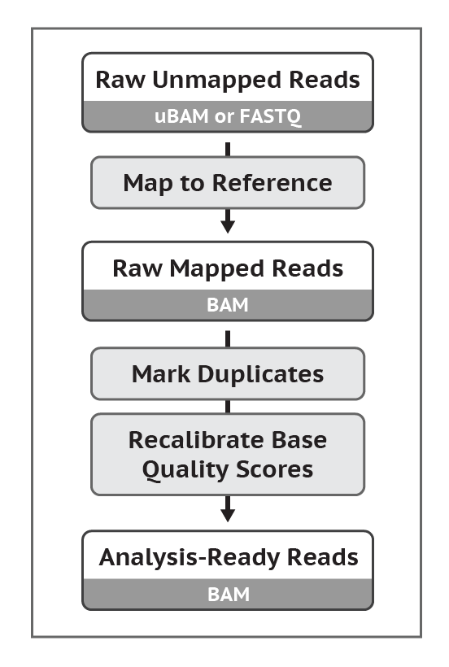

# Motivating Example: X-linked Disease

## Rare X-linked Disease


## Rare X-linked Disease


## Rare X-linked Disease


## Exon Capture Sequencing
{width=40%}
{width=50%}

## Exome Capture
\center
{height=90%}

## Exome Capture
\center
{height=90%}

## Rare X-linked Disease
\center
{height=90%}

## Rare X-linked Disease}
\center
{height=80%}

## Rare X-linked Disease


## Rare X-linked Disease


## N-terminal acetyltransferase (NAA10)
N-terminal acetyltransferase (NAT):

- Common modification (~80-90% of human proteins)
- Depletion from cancer cells linked to cell cycle arrest and apoptosis (Starheim, _BMC Proc_ 2009)
-	NAT genes directly implicated as cause of genetic disease
- Mutation demonstrated a significantly impaired biochemical activity _in vitro_
-	NAA10 lethal if knocked out of Drosophila

# Processing Raw Data

## Next-Generation Sequencing


## Study Design
Whole Exome

- Less expensive
- Nearly complete ascertainment of variation in the coding ~1\% of the genome (i.e. exons)
- Will miss functional variants outside of the coding region
	
Low Coverage Whole Genome 

- Less expensive
- Reasonably good ascertainment of shared variation, but not unique variation

Deep Whole Genome 

- More expensive
- Capture most of the genetic information
- Sequence the entire genome of each subject

<!--
## Analysis Pipelines (Broad Institute)
Queen/dictator of all analyses workflows: Genome Analysis Toolkit (GATK)


[Link to GATK at the Broad](https://software.broadinstitute.org/gatk/)
-->

## History and Evolution of Illumina Data Output
Illumina sequencers have given output in many different formats:

- Illumina .PRB and .INT files
  - Better access to raw data. 
  - Base calling algorithms (Bravo and Irizarry, _Biometrics_, 2010)
  - Mapping algorithms (GNUMAP, NOVO)
  - Confusing formats; Large data files 		
- Illumina .FASTQ files
- Sanger .FASTQ files	
	
## Illumina .INT and .PRB
{width=150%}

\vskip .2in
{width=150%}

## .fasta or .fa


## .fastq or .fq (or .fq.gz)
{width=125%}
\vskip .1in
{width=125%}
		

## .FASTQ Comparison
{width=100%, height=150%}

## Quality scores (PHRED)
Quality scores (Phred)

- Sanger Phred: Range=(0,40), $P = 1-10^{-(ASCII-33)/10}$
- Solexa: Range= (-5,40),  $P = \frac{10^{(ASCII-64)/10)}}{ 1+10^{(ASCII-64)/10}}$
- Illumina 1.3: (0,40),  $P = \frac{10^{(ASCII-64)/10)}}{ 1+10^{(ASCII-64)/10}}$
- Illumina 1.5: Range=(2,40), $P = 1-10^{-(ASCII-64)/10}$
- Illumina 1.8: Same as Sanger except Range=(0,41)


## .FASTQ Comparison


<!--
## Preprocessing (Broad Institute)
\center

}
-->

## Quality Control
Need to preprocess the reads:

- Check for quality (FASTQC)
-	Trim adapter and (Cutadapt, others)
- Remove duplicate reads, trim  low complexity/quality bases/reads (Prinseq)
- Complete pipelines: NCBI Toolkit, QC-Chain, PathoQC (pathoscope.sourceforge.net), others

\vskip .2in
**Note:** Not comprehensive or updated! 

## Read Quality Checks
\center
{height=90%}

## Read Quality Checks
\center


<!--
\frame
{
\footnotesize
	\frametitle{Quality Control (Outdated!)}
	Comparison of some of the more popular QC pipelines:
\begin{tabular}{l|c c c c c}
  \hline
  QC Features &  QCToolkit & QC-Chain & Cutadapt & Prinseq\\
  \hline
  %Supported NGS Platforms & Illumina,454 & Illumina,454 & Illumina & Illumina,454 & Illumina,454\\
  Parallel computation  & X & X &  & \\
  Phred offset detection  & X & X &  & \\
  Tag sequence removal  & X & X & X & \\
  Poly-A/T tail trimming  &  &  &  X & X\\
  PCR duplication filtering  &  & X &  & X\\
  Low complexity filtering  &  &  & & X\\
  Homopolymer removal	 & X &  & & X\\
  GC content filtering  &  & X & & X\\
  N/X content filtering  &  &  & & X\\
   \hline
\end{tabular}


}
-->

## FASTQC
\center
{height=90%}


## FastQC Example
Running FastQC from command-line: 

```{bash, eval=F}	
fastqc myfastqfile.fq --outdir=output/
```

Interactive GUI:
```{bash, eval=F}	
fastqc
```


# Mapping Reads

## Sequencing data alignment
Next-Generation Sequencing (NGS) Data present new challenges:

- Map `reads' to genome
- Call SNPs and variants from the reads
- Other Applications: RNA-seq, miRNAs, alternative splicing, ChIP-seq, BS-seq, RNA editing

Obstacles:

- Massive data size
- Repeat regions, rare variants
	
\vskip .2in
**Goal:** Develop an approach to put the puzzle together! 

<!--
%\frame{
%\frametitle{Mapping Algorithms}
%	\begin{itemize}
%		\item BLAST
%		\item BLAT
%		\item SOAP2
%		\item Bowtie2
%		\item BWA
%		\item STAR
%		\item Subread (Rsubread)
%		\item GNUMAP
%		\item NovoAlign
%		\item Many others!!
%	\end{itemize}
%}
-->

## Basic Local Alignment Search Tool (BLAST)
BLAST seed extension:


## Creating a Hash Index Table


## Creating a Hash Index Table


## Creating a Hash Index Table


## Creating a Hash Index Table


## Creating a Hash Index Table


## Read Lookup


## Read Lookup


## Read Lookup


## Read Lookup


## Read Lookup


## Session info
\tiny
```{r session info}
sessionInfo()
```

